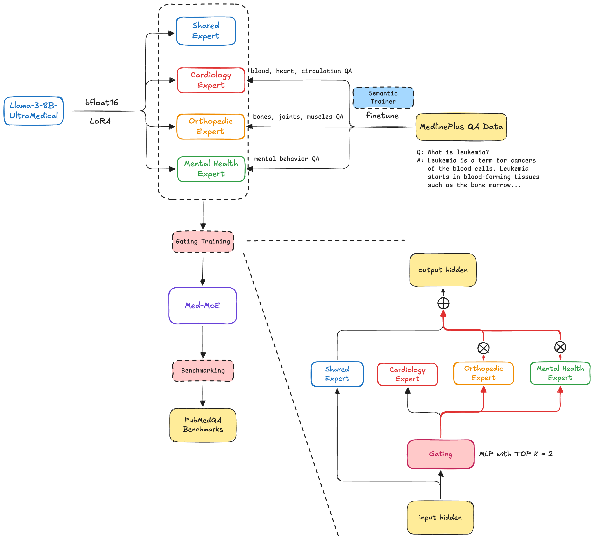

  

# 🏥 Agent Hospital Optimization via Llama-3-8B-UltraMedical + Mixture of Experts

**A research project by Xinzhuo Jiang and Dan Harvey**  
**Course: HPML | Columbia University**

## 🧠 Overview

Inspired by Jacobs et al.’s Mixture of Experts (MoE) and the Agent Hospital framework, this project proposes a novel optimization of clinical decision-making systems using **domain-specialized Llama-3-8B-UltraMedical experts** coordinated by an intelligent **gating network**—a virtual nurse dynamically routing patient queries to the right specialists.

Our goal is to deliver improved medical inference efficiency, diagnostic accuracy, and energy-aware compute through expert distillation, pruning, and smart expert selection.

---
## 👯 Team Information
- **Team Name**: [MedMoE]
- **Members**:
  - Dan Harvey (dyh2111)
  - Xinzhuo Jiang (xj2193)

---

## ❓ Problem Statement
Agentic implementations, such as the Agent Hospital framework, present a compelling approach for simulating patient journeys and clinical decision-making through autonomous multi-agent systems. However, when applied to large language models (LLMs), these systems encounter significant scalability and compute challenges. First, they require long, context-rich prompts to be delivered to all LLM agents at every step of the inference process. Second, the inherently sequential nature of prompting and agent interactions prevents parallelization, introducing latency bottlenecks that limit throughput. Lastly, inference becomes resource-intensive as specialized LLMs must be fully loaded and queried to handle decisions involving rare or domain-specific diseases, often without employing optimization strategies like model distillation, pruning, or sparse activation.

As LLMs scale into the billions of parameters, these inefficiencies become increasingly untenable, particularly for real-time applications in healthcare where responsiveness and resource management are critical.  Mixture of Experts architectures offer a promising solution by enabling selective activation of specialized subnetworks (experts), allowing models to scale capacity without a proportional increase in computational costs.
  

## 🎯 Objectives

1. **Construct a medical-focused MoE system**  
   Build and distill multiple expert models from MedLLaMA to handle medical subdomains (e.g., Neurology, Cardiology).

2. **Optimize the MoE architecture**  
   Develop a novel **fine-grained gating mechanism** inspired by DeepSeekMoE to route queries intelligently with minimal compute overhead.

3. **Benchmark against parent models**  
   Compare our MoE model to the original MedLLaMA in terms of:
   - Accuracy on medical exams and case studies
   - Inference latency
   - Memory and energy usage (via NVIDIA profiler)

---

## ⚙️ Model Description

### 🤖 Base Model
[TsinghuaC3I/Llama-3-8B-UltraMedical](https://huggingface.co/TsinghuaC3I/Llama-3-8B-UltraMedical/tree/main)

Hyperparameters:
- torch type: bfloat16
- epochs: 3
- learning rate: 2e-5
- learning rate scheduler type: cosine
- warmup ratio: 0.04
- max length: 1024
- global batch size: 128
- License: Meta Llama-3 License.
- Finetuned from model: Meta-Llama-3-8B
- Finetuned on data: UltraMedical

### 🩺 Gating Algorithm
- Sparse gating architecture
- Fine-grained expert segmentation: each expert is subdivided to increase routing flexibility
- Always-on **shared expert** to reduce redundancy
- Top-K routing via softmax scoring

### 🧬 Expert Formation
- Extract 3 domain experts from Llama-3-8B-UltraMedical (Cardiology, Orthopedic, Mental Health)
- Two distillation strategies:
  - **Activation-based pruning** (via forward hooks)
  - **Sparse dropout masking**
- All experts fine-tuned post-distillation

### 🧪 Implementation
- Question and answer data from [MedlinePlus API](https://medlineplus.gov/about/developers/webservices/)
- Built using **PyTorch**, trained on **A100 GPUs** (Colab Pro)

---

## 📊 Evaluation

We will assess:
- **Accuracy** on board-style medical questions and synthetic patient scenarios
- **Efficiency** using power/memory profiling tools
- **Zero-shot performance** vs. the base Llama-3-8B-UltraMedical model

---
## 📚 Final Results Summary

| Model                  | Size | GPU Memory (FP32) | GPU Load Time (s) | Accuracy (PubMedQA) | Inference Time (PubMedQA) (s) |
|------------------------|------|-------------------|--------------------|----------------------|---------------------|
| Llama 3.2 3B           | 3B   | 13.9 GB           | 2.54               | 0.732                | 42.77               |
| Qwen3 4B               | 4B   | 16.9 GB           | 3.09               | **0.768**            | 43.61               |
| Llama 3 8B UltraMedical| 8B   | 32.4 GB           | 5.13               | 0.730                | 30.67               |

| Quantization Level   | Batch Size | GPU Memory | GPU Load Time (s) | Accuracy (PubMedQA) | Inference Time (PubMedQA) (s) |
|----------------------|------------|----------------------|----------------|----------------------|----------------------------|
| UltraMedical FP32    | 32         | 32.4 GB              | 4.71       | **0.758**            | **47.31**              |
| UltraMedical FP16    | 32         | 17.4 GB              | 4.75       | **0.758**            | 47.47                  |
| UltraMedical Int8    | 32         | 10.2 GB              | 17.75      | **0.758**            | 51.19                  |
| UltraMedical Int4    | 32         | 8.1 GB               | 17.84      | 0.746                | 62.14                  |

## 🧠 Reproducibility Instructions

Please go through the notebook numbered forom 01 to 06

---

## 📊 Wandb Dashboard
View training and evaluation metrics here: https://wandb.ai/med-moe/projects

## 📚 References

1. Jacobs et al. (1991). *Adaptive Mixtures of Local Experts*  
2. Li et al. (2024). *Agent Hospital: A Simulacrum of Hospital with Evolvable Medical Agents*  
3. Dai et al. (2024). *DeepSeekMoE*  
4. Zhang et al. (2024). *UltraMedical: Building Specialized Generalists in Biomedicine*
5. https://github.com/OpenSparseLLMs/LLaMA-MoE-v2

---

## 🚧 Challenges & Future Work

- Selecting optimal pruning/distillation strategies
- Balancing expert specialization vs. generalization
- Integrating with existing quantized/LoRA-tuned LLaMA variants
- Exploring Mixtral and DeepSeek insights for model evolution

## NOTES:
✅ Recommended Target
3x small models: ~1.3B parameters each
1x large model: ~2.5–2.7B parameters
Routing/output networks: ~100–200M combined
Keep total ≤ 6.5–7B parameters (FP16)

https://nvidia.github.io/TensorRT-Model-Optimizer/getting_started/7_sparsity.html
https://github.com/horseee/LLM-Pruner#1-pruning-discovery-stage--estimation-stage

## Extracted Experts on Hugging Face
🤗 Cardiology Expert: https://huggingface.co/med-moe/llama3-8B-UltraMedical-MoE-Cardiology-Expert

🤗 Orthopedic Expert: https://huggingface.co/med-moe/llama3-8B-UltraMedical-MoE-Orthopedic-Expert

🤗 MentalHealth Expert: https://huggingface.co/med-moe/llama3-8B-UltraMedical-MoE-MentalHealth-Expert
